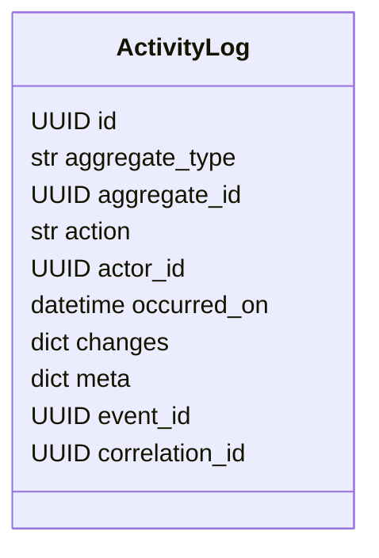

# Модуль `activity`

## 1. Название и краткое описание

`activity` предназначен для записи и чтения истории действий по доменным событиям. Он содержит recorder, registry мапперов событий в activity log и потенциальный API просмотра журнала.

## 2. Границы ответственности

**Делает:** записывает `ActivityLog`, хранит историю по actor/action/aggregate, предоставляет пагинацию журнала. **Не делает:** не публикует доменные события и не определяет бизнес-события других модулей.

## 3. Глоссарий

| Термин | Значение |
|---|---|
| `ActivityLog` | Запись действия с actor, aggregate, action, changes/meta и correlation ids. |
| `ActivityRecorder` | Сервис, который получает события и пишет activity logs. |
| `ActivityLogFilters` | Фильтры журнала: actor, actions, диапазон дат. |

## 4. Структура папок

```text
backend/src/activity/
├── router.py              # FastAPI endpoint журнала
├── dependencies.py        # DI repository/recorder/pagination
├── domain/                # ActivityLog, filters, repository protocol
├── infra/                 # SQLAlchemy model/repository
├── mappers.py             # domain -> response schema
├── recorder.py            # запись activity logs по events
├── registry.py            # event -> activity mapper registry
└── schemas.py             # ActivityLogResponse
```

## 5. Доменная модель



Статусов и переходов нет.

## 6. Ключевые сценарии (use cases)

| Сценарий | Входные данные | Шаги | Результат | Ошибки |
|---|---|---|---|---|
| Запись activity | `list[Event]` | `ActivityRecorder.record_all()` → registry mapper → repository | Записи в `activity_logs` | Отсутствующий mapper логируется и пропускается |
| Просмотр журнала | query filters + pagination | endpoint → paginator/repository | `Page[ActivityLogResponse]` | auth/validation/internal |

## 7. Публичный API модуля

> Важно: `activity` router не подключён в `backend/src/__init__.py`, поэтому endpoint описан как потенциальный по коду `router.py`.

| Метод | Путь | Назначение | Авторизация | Файл |
|---|---|---|---|---|
| GET | `/api/v1/activity-logs` | Получить историю действий | `require_role([UserRole.ADMIN])` | `router.py` |

### GET `/api/v1/activity-logs`

**Запрос:** query фильтры из `ActivityLogFilters`: `actor_id`, `actions`, `occurred_after`, `occurred_before`, плюс pagination из shared dependencies.

**Успешный ответ:** `200 OK`, `Page[ActivityLogResponse]`.

**Ошибки:** 401/403 от IAM role dependency, 422 FastAPI validation, 500 для необработанных ошибок.

**Побочные эффекты:** нет. **Идемпотентность:** да.

**Внутренние контракты:** `ActivityRecorder` используется shared transaction flow для записи событий; registry должен знать mapper для каждого event.

## 8. События

Модуль потребляет events как Python objects через `ActivityRecorder.record_all`, но не подписывается на Rabbit сам. События без зарегистрированного mapper пропускаются с warning.

## 9. Хранение данных

| Таблица | Назначение | Ключевые поля/индексы |
|---|---|---|
| `activity_logs` | Журнал действий | `aggregate_type`, `aggregate_id`, `actor_id`, `action`, `occurred_on`, JSONB `changes`, `meta`; GIN indexes for JSONB |

## 10. Зависимости

IAM (`require_role`, `UserRole.ADMIN`), shared pagination/session, SQLAlchemy/PostgreSQL JSONB, shared domain events.

## 11. Конфигурация

Не применимо: собственных settings/env параметров не найдено.

## 12. Фоновые процессы

Не применимо: собственных jobs/schedulers нет.

## 13. Безопасность и права доступа

Endpoint просмотра ограничен ролью `ADMIN`. Запись activity выполняется внутренними сервисами через recorder.

## 14. Каталог ошибок модуля и их HTTP-статусов

### a) Единый формат ошибки

Глобальный handler: `backend/src/shared/api/exception_handler.py` (`DomainError`, `ValueError`).

### b) Таблица ошибок

| Ошибка | HTTP | Когда | Где | Endpoints |
|---|---:|---|---|---|
| `PermissionDeniedError`/auth errors | 401/403 | Нет роли admin | IAM dependencies | GET activity logs |
| FastAPI validation | 422 | Невалидные query params | FastAPI | GET activity logs |
| `KeyError` mapper | не HTTP | Нет mapper event | `registry.py`, ловится в `recorder.py` | внутренний recorder |
| Unhandled | 500 | DB/runtime error | infra/repo | GET activity logs |

### c) Правила маппинга

HTTP errors идут через IAM/shared/FastAPI handlers. `KeyError` mapper не превращается в HTTP, а логируется recorder.

### d) Формат ошибок валидации

Стандартный FastAPI `422` для query params.

## 15. Тестирование

Тесты для `activity` в `backend/tests` не найдены.

## 16. Как с этим работать разработчику

Для нового события добавьте mapper в `registry.py`/регистрацию mapper; убедитесь, что `ActivityLogResponse` поля совпадают с mapper.

## 17. Наблюдения и технический долг

- Router не подключён в `backend/src/__init__.py`.
- `router.py` импортирует `paginate_activity_logs`, но в `dependencies.py` по анализу есть `paginate_activities`/`get_activity_paginator`.
- `mappers.py` использует `occurred_at`, а `ActivityLogResponse` ожидает `occurred_on`.
- `ActivityRecorderDep` типизирован как `ActivityLogRepository`, но dependency возвращает `ActivityRecorder`.

## 18. Открытые вопросы

- Нужно ли подключать `activity` API к root router?
- Какой полный набор events должен иметь activity mapper?
