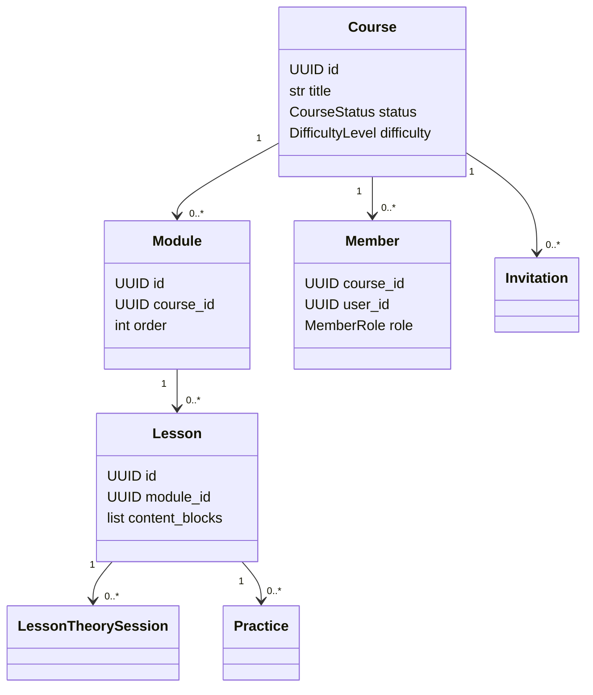
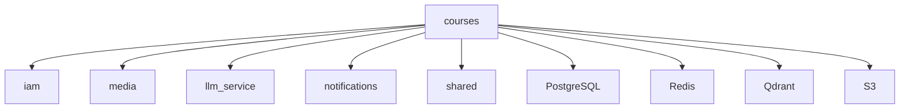

# Модуль `courses`

## 1. Название и краткое описание

`courses` отвечает за создание, редактирование, публикацию и прохождение курсов: курсы, модули, уроки, участники, приглашения, теоретические сессии, практики и AI-агенты. Модуль предоставляет REST API FastAPI и использует LLM-агентов для генерации/проверки учебного контента.

## 2. Границы ответственности

**Делает:**

- управляет курсами, модулями и уроками;
- хранит структуру курса и `content_blocks` уроков;
- управляет участниками курса и приглашениями;
- запускает AI-сценарии интервьюера, редактора, ментора, тестов и практики;
- обрабатывает документы для преобразования/загрузки;
- фиксирует теоретические сессии пользователя.

**Не делает:**

- не управляет пользователями и ролями IAM напрямую — использует `src/iam`;
- не хранит бинарные файлы самостоятельно — для медиа использует `src/media`/S3-клиент;
- не отправляет уведомления напрямую — публикует событие `CourseInvited`, которое потребляет `notifications`.

## 3. Глоссарий

| Термин | Значение |
|---|---|
| `Course` | Курс с названием, описанием, сложностью, тегами, статусом, модулями и участниками. |
| `Module` | Раздел курса, связанный с курсом и содержащий уроки. |
| `Lesson` | Учебный урок с метаданными и списком `content_blocks`. |
| `ContentBlock` | Блок контента урока: текст, изображение, код, quiz, Mermaid, формула и т.д. |
| `Member` | Участник курса с ролью `teacher`, `moderator` или `student`. |
| `Invitation` | Приглашение в курс по email/token. |
| `LessonTheorySession` | Метрики прохождения теоретической части урока пользователем. |
| `Practice` | Практическое задание или тест, связанный с пользователем/модулем/уроком. |

## 4. Структура папок

```text
backend/src/courses/
├── api/v1/                  # FastAPI-роутеры модуля
├── agents/                  # LLM/LangGraph агенты курса, ментора, редактора, тестера, практики
├── application/             # DTO, сервисы, политики доступа, интерфейсы репозиториев
├── dependencies/            # FastAPI Depends для репозиториев, сервисов и агентов
├── domain/                  # Доменные сущности, value objects, события, permissions, exceptions
├── infra/                   # SQLAlchemy-модели, репозитории, клиенты внешних API/media
├── utils/                   # Обработка документов и вспомогательные функции
└── docs/                    # Подробная документация API модуля
```

## 5. Доменная модель

Ключевые сущности описаны в `backend/src/courses/domain/entities.py`, value objects и enum — в `backend/src/courses/domain/vo.py`.



Статусы курса из `CourseStatus`: `in_generation`, `draft`, `invite_only`, `published`, `archived`. Переходы статусов явно вызываются API: `publish_course()` переводит в `PUBLISHED`, `delete_course()` — в `ARCHIVED`, `invite_only_course()` — в `INVITE_ONLY` (`backend/src/courses/api/v1/course.py`). Полная state machine в коде не выделена.

## 6. Ключевые сценарии (use cases)

| Сценарий | Входные данные | Шаги | Результат | Ошибки |
|---|---|---|---|---|
| Создание курса | `CourseSchema` | API `/course/create` → `CourseService.create()` → repository create → commit | `Course`, HTTP 201 | auth/permission, validation, DB/internal |
| Редактирование курса | `course_id`, `EditCourseSchema` | Проверка доступа через `CheckAccess` → update | Обновлённый `Course` | `NotFoundError`, `PermissionDeniedError` |
| Публикация/архивация/перевод invite-only | `course_id` | Проверка доступа → изменение `status` | `null`, HTTP 200 | `NotFoundError`, `PermissionDeniedError` |
| Создание модуля/урока | DTO + необязательный parent id | Сервис создаёт сущность и при наличии id привязывает к родителю | `Module`/`Lesson` | `NotFoundError`, validation |
| Приглашение в курс | `InvitationCreate` | Проверка policy → создание `Invitation` → событие `CourseInvited` | `Invitation`, HTTP 201 | `AlreadyExistsError`, `NotFoundError` |
| Генерация/проверка практики | path ids/body/form-data | API agents → внешние LLM services/repositories | JSON задания или `PracticeResult` | `NotFoundError`, ошибки LLM, validation |
| Загрузка документа | multipart file | Проверка расширения/пустоты/лимита → pipeline/document service | markdown или `{message}` | 400, 413 |

## 7. Публичный API модуля

Полный API описан в [`docs/api.md`](docs/api.md), потому что в модуле больше 10 эндпоинтов.

| Метод | Путь | Назначение | Авторизация | Файл контроллера/обработчика |
|---|---|---|---|---|
| POST | `/api/v1/course/create` | Создать курс | `require_permissions(CREATE.code)` | `api/v1/course.py` |
| POST | `/api/v1/course/` | Получить курсы с пагинацией | Явно не задана | `api/v1/course.py` |
| POST | `/api/v1/course/my-courses` | Курсы текущего пользователя | `CurrentIdentity` | `api/v1/course.py` |
| GET | `/api/v1/course/{course_id}/status` | Статус курса | `CurrentIdentity` | `api/v1/course.py` |
| GET | `/api/v1/course/basic/info/{course_id}` | Basic info курса | Явно не задана | `api/v1/course.py` |
| PUT | `/api/v1/course/edit/{course_id}` | Редактировать курс | `CheckAccessDep(UPDATE)` | `api/v1/course.py` |
| POST | `/api/v1/course/publish/{course_id}` | Опубликовать курс | `CheckAccessDep(UPDATE)` | `api/v1/course.py` |
| DELETE | `/api/v1/course/delete/{course_id}` | Архивировать курс | `CheckAccessDep(DELETE)` | `api/v1/course.py` |
| POST | `/api/v1/course/{course_id}/invite-only` | Сделать курс invite-only | `CheckAccessDep(UPDATE)` | `api/v1/course.py` |
| POST | `/api/v1/module/create` | Создать модуль | `require_permissions(CREATE.code)` | `api/v1/module.py` |
| POST | `/api/v1/module/assign/{module_id}/{course_id}` | Привязать модуль к курсу | `CheckAccessDep(UPDATE)` | `api/v1/module.py` |
| GET | `/api/v1/module/basic/info/{module_id}` | Basic info модуля | `CheckAccessDep(READ)` | `api/v1/module.py` |
| PUT | `/api/v1/module/edit/{module_id}` | Редактировать модуль | `CheckAccessDep(UPDATE)` | `api/v1/module.py` |
| DELETE | `/api/v1/module/{module_id}` | Удалить модуль | `require_permissions(DELETE.code)` + access | `api/v1/module.py` |
| POST | `/api/v1/lesson/create` | Создать урок | Явно не задана | `api/v1/lesson.py` |
| POST | `/api/v1/lesson/assign/{lesson_id}/{module_id}` | Привязать урок к модулю | `CheckAccessDep(UPDATE)` | `api/v1/lesson.py` |
| GET | `/api/v1/lesson/basic/info/{lesson_id}` | Basic info урока | `CheckAccessDep(READ)` | `api/v1/lesson.py` |
| GET | `/api/v1/lesson/theory/{lesson_id}` | Теория урока | `CheckAccessDep(READ)` | `api/v1/lesson.py` |
| PUT | `/api/v1/lesson/edit/{lesson_id}` | Редактировать урок | `CheckAccessDep(UPDATE)` | `api/v1/lesson.py` |
| PUT | `/api/v1/lesson/update/{lesson_id}` | Обновить content blocks | `CheckAccessDep(UPDATE)` | `api/v1/lesson.py` |
| DELETE | `/api/v1/lesson/{lesson_id}` | Удалить урок | `CheckAccessDep(DELETE)` | `api/v1/lesson.py` |
| POST | `/api/v1/members/{course_id}/sign` | Записаться на курс | `CurrentIdentity` | `api/v1/member.py` |
| POST | `/api/v1/members/` | Курсы участника | `CurrentIdentity` | `api/v1/member.py` |
| POST | `/api/v1/members/{course_id}` | Студенты курса | `require_permissions(UPDATE.code)` | `api/v1/member.py` |
| POST | `/api/v1/agent/*` | AI-сценарии | `CurrentIdentity` + местами `CheckAccessDep` | `api/v1/agents.py` |
| POST | `/api/v1/documents/*` | Документы | `CurrentIdentity` | `api/v1/documents.py` |
| POST | `/api/v1/courses/invitations` | Создать приглашение | invite policy | `api/v1/invitations.py` |
| POST | `/api/v1/courses/invitations/accept/{token}` | Принять приглашение | `CurrentIdentity` | `api/v1/invitations.py` |
| POST/PUT/GET | `/api/v1/theory/session/*` | Теоретические сессии | `CurrentIdentity` + policies | `api/v1/theory_session.py` |

### Внутренние контракты для других модулей

| Контракт | Где | Назначение |
|---|---|---|
| `CourseInvited` | `domain/events.py` | Интеграционное событие приглашения в курс. |
| `SrvCourseClient` | `infra/external_apis.py` | Вызовы IAM: поиск пользователя по email, создание системного приглашения. |
| `MediaClient` | `infra/media_client.py` | Создание upload URL, PUT файла, подтверждение upload в media. |
| Repository protocols | `application/repos.py` | Интерфейсы хранилищ для сервисов и API. |

## 8. События

| Название | Публикуется/потребляется | Когда возникает | Структура данных | Кто подписан |
|---|---|---|---|---|
| `CourseInvited` / `courses.invited` | Публикуется | При создании приглашения `Invitation.create()`/`invite()` | `invitation_id`, `email`, `role`, `course_id`, `invited_by`, `url` | `notifications/api/v1/handlers.py` |

## 9. Хранение данных

ORM находится в `backend/src/courses/infra/database/models.py`.

| Таблица | Назначение | Ключевые поля/связи |
|---|---|---|
| `courses` | Курсы | `creator_id`, `status`, `difficulty`, `tags`, `learning_objectives` |
| `modules` | Модули курса | `course_id`, `order`, index `ix_modules_course_id` |
| `lessons` | Уроки | `module_id`, `content_blocks`, index `ix_lessons_module_id` |
| `lesson_theory_sessions` | Метрики прохождения | `lesson_id`, `user_id`, checks active time/scroll depth |
| `chats` | История чатов | `user_id`, `course_id`, `messages JSONB` |
| `members` | Участники | `course_id`, `user_id`, `role`, unique `(course_id,user_id)` |
| `documents` | Дерево документов | self-reference `parent_id`, JSON/индексы владельца и типа |
| `practices` | Практики/тесты | `user_id`, `module_id`, `lesson_id`, `practice JSONB`, `status` |
| `course_invitations` | Приглашения | `token`, `email`, `role`, `expires_at`, `is_used` |

## 10. Зависимости



Зависимости подтверждены импортами `src.iam`, `src.llm_service`, `src.shared`, media client, Qdrant/Redis в agent workflow и обработкой события `CourseInvited` в `notifications`.

## 11. Конфигурация

| Параметр | Назначение | Значение по умолчанию | Обязательность |
|---|---|---|---|
| `settings.frontend_url` | Формирование URL приглашения | Не определено в модуле | Требуется для ссылок приглашений |
| `settings.text_ai_model` | Модель LLM по умолчанию через `llm_router`/`llm_service` | Не определено в модуле | Требуется для LLM сценариев |
| Qdrant collection `MAIN_COLLECTION` | Векторное хранилище знаний | Создаётся в `core/lifespan.py` | Требуется для retrieval/agents |
| Redis checkpointer | Состояние LangGraph/checkpointer | Настройки в `core/redis` | Требуется для agents |

## 12. Фоновые процессы

| Процесс | Где | Что делает | Идемпотентность |
|---|---|---|---|
| `generate_course` dramatiq actor | `agents/course_generator/workflow.py` | Генерирует курс через workflow/LLM | Из кода не видно гарантий идемпотентности; при ошибке логирует и пробрасывает исключение. |

## 13. Безопасность и права доступа

- Авторизация через `CurrentIdentity` и `require_permissions` из `iam`.
- Точечные проверки доступа к курсу/модулю/уроку выполняет `CheckAccess` (`application/check_access.py`).
- Права курса объявлены в `domain/permissions/courses.py`, `invitations.py`, `practice.py`, `theory_session.py`.
- Некоторые endpoints не имеют явной авторизации; они перечислены в «Наблюдения и технический долг».

## 14. Каталог ошибок модуля и их HTTP-статусов

### a) Единый формат ошибки

Глобальная обработка находится в `backend/src/shared/api/exception_handler.py`.

`DomainError`:

```json
{"error":{"code":"RESOURCE_NOT_FOUND","message":"Ресурс не найден","details":{}}}
```

`ValueError`:

```json
{"error":{"grant":"VALIDATION_ERROR","message":"...","status":400,"details":{}}}
```

FastAPI `HTTPException` возвращается стандартным обработчиком FastAPI, например:

```json
{"detail":"Metrics not found"}
```

### b) Таблица всех ошибок модуля

| Ошибка | HTTP-статус | Сообщение/title | Когда возникает | Где выбрасывается | Эндпоинты |
|---|---:|---|---|---|---|
| `PayloadTooLargeError` | 413 | `PAYLOAD_TOO_LARGE` | Файл/запрос больше лимита | `domain/exceptions.py`, document utils | `/documents/*` |
| `NotFoundError` | 404 | `RESOURCE_NOT_FOUND` | Не найден course/module/lesson/member/practice | services/agents/check_access | Многие endpoints |
| `AlreadyExistsError` | 409 | `ALREADY_EXISTS` | Дубликаты membership/invitation | services | invitations/members |
| `PermissionDeniedError` | 403 | `PERMISSION_DENIED` | Не хватает прав | `iam` dependencies/policies | защищённые endpoints |
| `UnauthorizedError` | 401 | `UNAUTHORIZED` | Нет/невалидный Bearer token | `iam` identity dependency | endpoints с `CurrentIdentity` |
| `HTTPException` | 404 | `detail` может быть пустым/`Metrics not found` | Нет статуса курса или theory session | `api/v1/course.py`, `api/v1/theory_session.py` | status/update session |
| `HTTPException` | 400 | Недопустимое расширение/пустой файл | Валидация upload file | `api/v1/documents.py` | `/documents/*` |
| `ValueError` | 400 | `VALIDATION_ERROR` | Ошибки VO/Pydantic helpers | shared handler | потенциально все |
| Необработанное исключение | 500 | Стандартный FastAPI 500 | Ошибка БД/LLM/интеграции без маппинга | неявно | потенциально все |

### c) Правила маппинга

`DomainError` маппится по `exc.status_code`, `exc.error_code`, `exc.message`, `exc.details` в `shared/api/exception_handler.py`. Для `HTTPException` используется стандартный FastAPI handler. Исключения без маппинга превращаются в 500 стандартным механизмом ASGI/FastAPI.

### d) Формат ошибок валидации

Pydantic/FastAPI validation errors явно не переопределены в `shared/api/exception_handler.py`, поэтому используется стандартный формат FastAPI `422` с полем `detail`. `ValueError` перехватывается отдельно и возвращает `400` с полем `error.grant`.

## 15. Тестирование

Актуальные тесты для `courses` в `backend/tests` не обнаружены. Общая команда запуска, если окружение настроено: `pytest`. В рамках подготовки документации тесты не запускались, так как задача запрещает команды с побочными эффектами; выполнялся только статический анализ файлов.

## 16. Как с этим работать разработчику

- Новый endpoint добавляйте в `api/v1/*.py`, а бизнес-логику — в `application/services/*`.
- Для доступа к курсу используйте `CheckAccess`, а не ручные проверки в контроллере.
- Новые права регистрируйте в `domain/permissions/*`.
- Новые события оформляйте в `domain/events.py`; убедитесь, что обработчик есть в `notifications`, если событие должно создавать уведомление.
- Для новых content blocks обновляйте union `AnyContentBlock` и сериализацию `ContentBlockListType`.

## 17. Наблюдения и технический долг

- `POST /lesson/create`, `POST /course/`, `GET /course/basic/info/{course_id}` не имеют явной auth/access проверки.
- `check_test` и `check_practice` требуют identity, но из прочитанного кода не видно проверки доступа к `practice_id`.
- `PUT /theory/session/{theory_session_id}` проверяет наличие, но не владельца/доступ к session.
- `DELETE /course/delete/{course_id}` возвращает 200 и архивирует курс, а не удаляет.
- В `ModuleService.assign_course` тексты ошибок выглядят перепутанными.
- `external_apis.py` скрывает ошибки bare `except` и возвращает `None`.
- Защита дерева `documents` от циклов покрывает только прямую самоссылку по комментарию в ORM.

## 18. Открытые вопросы

- Является ли отсутствие auth на публичных course/lesson endpoints намеренным?
- Какие гарантии идемпотентности ожидаются от `generate_course` и agent endpoints?
- Какие внешние ошибки LLM должны маппиться в HTTP-статусы, отличные от 500?
- Нужно ли возвращать доменные dataclass-сущности напрямую как публичный API-контракт или требуются response DTO?
