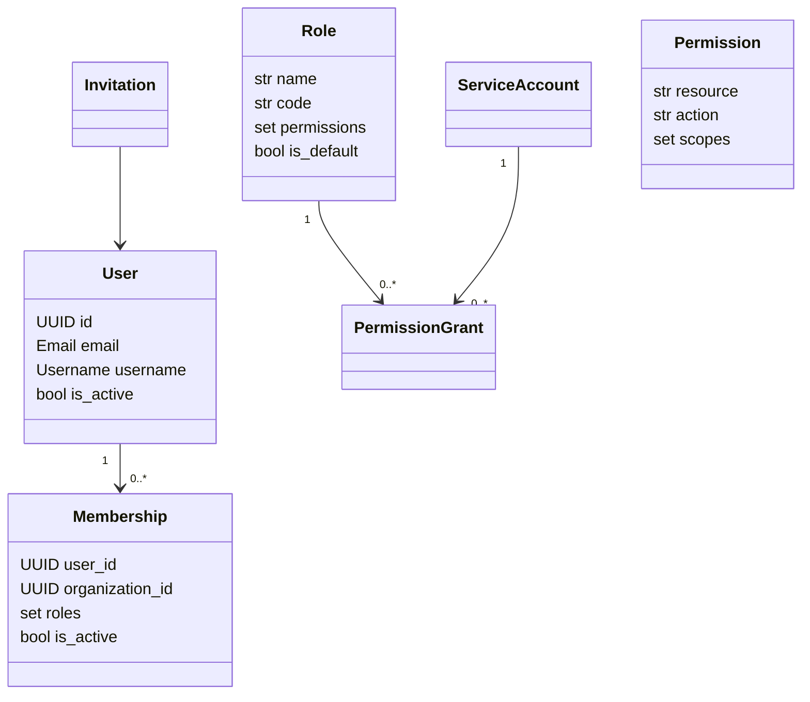
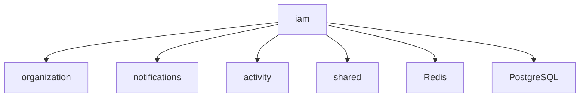

# Модуль `iam`

## 1. Название и краткое описание

`iam` отвечает за identity and access management: пользователей, вход, JWT/OAuth токены, роли, permissions, membership, приглашения и service accounts. Модуль является источником авторизации для остальных модулей через `CurrentIdentity`, `require_permissions` и policies.

## 2. Границы ответственности

**Делает:**

- аутентифицирует пользователей по email/password;
- выдаёт access/refresh tokens и OAuth client credentials tokens;
- управляет пользователями, ролями, permissions, memberships и service accounts;
- создаёт и принимает системные приглашения пользователей;
- проверяет силу пароля и валидирует value objects.

**Не делает:**

- не управляет курсами/организациями как доменами, но хранит membership и role grants;
- не отправляет уведомления напрямую — генерирует `UserInvited`, которое потребляет `notifications`;
- не решает object-level доступ курсов — это делает `courses.application.check_access` поверх IAM permissions.

## 3. Глоссарий

| Термин | Значение |
|---|---|
| `Identity` | Текущий субъект запроса: user/service account/AI agent, roles, permissions, organization/membership. |
| `User` | Пользователь с email, username, full name, avatar, password hash и флагом активности. |
| `ServiceAccount` | Machine identity с `client_id`/secret hash и ролями в организации. |
| `Membership` | Связь пользователя и организации с набором ролей. |
| `Permission` | Зарегистрированное право вида `resource.action` со scopes. |
| `Role` | Набор `PermissionGrant`, который можно выдать membership/service account. |
| `Invitation` | Приглашение пользователя в систему/организацию по token. |

## 4. Структура папок

```text
backend/src/iam/
├── api/v1/                  # REST API: auth, users, roles, permissions, memberships, invitations, service_accounts
├── application/             # DTO, CRUD, policies, сервисы, repository protocols
├── dependencies/            # FastAPI dependencies для identity, permissions, repos, services
├── domain/                  # entities, value objects, permissions, events, services, exceptions
├── infra/database/          # SQLAlchemy ORM, mappers, repositories
├── security.py              # JWT, password hashing, client secrets, password strength
├── consts.py                # Константы client credentials
└── docs/                    # Подробная документация API
```

## 5. Доменная модель

Сущности находятся в `domain/entities.py`, VO — в `domain/vo.py`.



`PermissionScope`: `global`, `organization`, `course`, `own`, `object`. Default roles нельзя обновлять/удалять по инвариантам `Role`/CRUD.

## 6. Ключевые сценарии (use cases)

| Сценарий | Входные данные | Шаги | Результат | Ошибки |
|---|---|---|---|---|
| Login | `UserCredentials` | Проверка email/password → authentication token + memberships | `LoginResponse` | `UnauthorizedError` |
| Выдача JWT | `authentication_token`, `membership_id` | Проверка membership → access/refresh JWT | `TokensResponse` | `UnauthorizedError`, `NotFoundError` |
| Refresh/logout | refresh/access tokens | Проверка JWT/blacklist → новые токены или blacklist | `TokensResponse`/`None` | `UnauthorizedError` |
| OAuth client credentials | form `client_id`, `client_secret` | Проверка service account secret/active | `OAuthTokenResponse` | `UnauthorizedError` |
| Создание invitation | `InvitationCreate` | Проверка permission → token/event | `Invitation` | `AlreadyExistsError`, `NotFoundError` |
| Accept invitation | token + `CreateUserDTO` | Проверка token/password → user/membership/tokens | `TokensResponse` | `WeakPasswordError`, `AlreadyExistsError` |
| Управление roles/permissions | role DTO | CRUD + invariants | `RoleResponse` | `PermissionDeniedError`, `InvariantViolationError` |

## 7. Публичный API модуля

Полная детализация endpoints находится в [`docs/api.md`](docs/api.md).

| Метод | Путь | Назначение | Авторизация | Файл контроллера/обработчика |
|---|---|---|---|---|
| POST | `/api/v1/auth/login` | Login | Нет | `api/v1/auth.py` |
| POST | `/api/v1/auth/token` | Выдать JWT | Нет | `api/v1/auth.py` |
| POST | `/api/v1/auth/token/refresh` | Refresh JWT | Нет | `api/v1/auth.py` |
| POST | `/api/v1/auth/logout` | Logout/blacklist | Нет | `api/v1/auth.py` |
| GET | `/api/v1/auth/identity` | Текущая identity | Bearer | `api/v1/auth.py` |
| POST | `/api/v1/oauth/token` | OAuth client credentials | Нет | `api/v1/oauth.py` |
| GET/PATCH/POST | `/api/v1/users*` | Пользователи | Bearer | `api/v1/users.py` |
| POST/GET/PATCH/DELETE | `/api/v1/roles*` | Роли | permissions, частично не задано | `api/v1/roles.py` |
| GET | `/api/v1/permissions` | Permissions registry | `permissions.read` | `api/v1/permissions.py` |
| POST/GET | `/api/v1/memberships*` | Membership | permissions | `api/v1/memberships.py` |
| POST/DELETE | `/api/v1/invitations*` | Системные приглашения | permissions/none for accept | `api/v1/invitations.py` |
| POST/GET/PATCH/DELETE | `/api/v1/service-accounts*` | Service accounts | Не задана | `api/v1/service_accounts.py` |

### Внутренние контракты для других модулей

| Контракт | Где | Назначение |
|---|---|---|
| `CurrentIdentity` | `dependencies/identity.py` | Получение текущего субъекта из Bearer JWT. |
| `require_permissions` | `dependencies/permissions.py` | Проверка permission codes. |
| `authorize` | `application/policies.py` | Проверка permission against identity/scopes. |
| `UserInvited` | `domain/events.py` | Событие приглашения пользователя. |
| `Permission` registry | `domain/permissions/registry.py` | Регистрация permissions разных модулей. |

## 8. События

| Название | Публикуется/потребляется | Когда возникает | Структура данных | Кто подписан |
|---|---|---|---|---|
| `UserInvited` / `users.invited` | Публикуется | `Invitation.invite()` | `invitation_id`, `email`, `granted_roles`, `organization_id`, `invited_by`, `url` | `notifications/api/v1/handlers.py` |

## 9. Хранение данных

ORM: `infra/database/models.py`.

| Таблица | Назначение | Ключевые поля/индексы |
|---|---|---|
| `users` | Пользователи | `email` unique, `username`, `password_hash` unique, `is_active`, `ix_users_is_active` |
| `service_accounts` | Machine accounts | `client_id` unique, `client_secret_hash`, `organization_id`, `roles JSONB` |
| `memberships` | User ↔ organization | `user_id`, `organization_id`, `roles JSONB`, unique `(user_id, organization_id)` |
| `permissions` | Permission registry | unique `(resource, action)`, `scopes JSONB` |
| `roles` | Роли | `code` unique, `permissions JSONB`, `is_default` |
| `invitations` | Системные приглашения | `token` unique, `email`, `organization_id`, `expires_at`, `is_used` |

## 10. Зависимости



Подтверждённые зависимости: Redis blacklist (`application/services/blacklist.py`, deps repos), organization repository/ref в login/service accounts, transaction recorder/activity, shared domain errors/DTO.

## 11. Конфигурация

| Параметр | Назначение | Значение по умолчанию | Обязательность |
|---|---|---|---|
| `settings.secret_key` | Подпись JWT | Не задано в модуле | Обязателен |
| `jwt_config.*` | TTL/алгоритм JWT | В `core/settings`/config | Обязателен |
| `settings.frontend_url` | URL accept invitation | Не задано в модуле | Нужен для invitation URL |
| Redis config | Token blacklist | В `core/redis` | Нужен для logout/revocation |
| `CLIENT_ID_LENGTH`, `CLIENT_SECRET_LENGTH` | Размеры credentials | `consts.py` | Используется service accounts |

## 12. Фоновые процессы

Не применимо: в модуле не найдено собственных jobs/schedulers. События публикуются через shared transaction/event publisher.

## 13. Безопасность и права доступа

- Bearer auth декодирует JWT в `CurrentIdentity`.
- Проверяется blacklist по `jti`.
- Password hashing и verification находятся в `security.py`.
- OAuth client secret хранится как hash (`SecretHash`/service account secret hash).
- Permissions проверяются через `require_permissions(*codes, any_of=True)`.

## 14. Каталог ошибок модуля и их HTTP-статусов

### a) Единый формат ошибки

`DomainError` и `ValueError` маппятся в `backend/src/shared/api/exception_handler.py`.

```json
{"error":{"code":"UNAUTHORIZED","message":"Требуется авторизация","details":{}}}
```

Для `ValueError`:

```json
{"error":{"grant":"VALIDATION_ERROR","message":"...","status":400,"details":{}}}
```

### b) Таблица всех ошибок модуля

| Ошибка | HTTP-статус | Сообщение / title | Когда возникает | Где выбрасывается | Endpoint |
|---|---:|---|---|---|---|
| `WeakPasswordError` | 422 | `WEAK_PASSWORD` | Слабый пароль при регистрации | `domain/exceptions.py`, registration/invitation services | accept invitation |
| `PermissionDeniedError` | 403 | `PERMISSION_DENIED` | Недостаточно прав | `domain/exceptions.py`, policies/dependencies | protected endpoints |
| `UnauthorizedError` | 401 | `UNAUTHORIZED` | Невалидные credentials/JWT/client secret | auth/oauth/identity | auth/oauth/protected |
| `InvitationExpiredError` | 410 | `INVITATION_EXPIRED` | Определён класс; текущий accept flow по анализу отдаёт 404 | `domain/exceptions.py` | open question |
| `NotFoundError` | 404 | `RESOURCE_NOT_FOUND` | Не найден user/role/membership/invitation/service account | CRUD/services | many |
| `AlreadyExistsError` | 409 | `ALREADY_EXISTS` | Дубликат user/membership/role | services/CRUD | create/accept |
| `InvariantViolationError` | 409 | `INVARIANT_VIOLATION` | Нельзя менять default role/последний permission | role domain/CRUD | roles |
| `UnsupportedOperationError` | 405 | `UNSUPPORTED_OPERATION` | Неподдержанная операция | shared/domain | потенциально |
| `HTTPException` | 404 | `detail` | User/membership by id/email не найден в прямых API | `api/v1/users.py`, `api/v1/memberships.py` | users/memberships |
| `ValueError` | 400 | `VALIDATION_ERROR` | VO validation, policies | VO/shared handler | many |
| FastAPI validation | 422 | `detail` | Невалидный request body/query/path | FastAPI | all |
| Unhandled | 500 | standard | Ошибка без маппинга | FastAPI | all |

### c) Правила маппинга

`DomainError` → статус и тело по полям exception; `ValueError` → 400. `HTTPException` обрабатывает FastAPI. Если маппинга нет, будет стандартный 500.

### d) Формат ошибок валидации

Pydantic/FastAPI validation errors не переопределены: стандартный `422` с `detail`. VO `ValueError` возвращается как `400` через shared handler.

## 15. Тестирование

Видимые тесты: `backend/tests/unit/iam/test_dataclasses.py`, `test_mappers.py`, `test_security.py`, `test_services.py`, `test_username.py`. Запуск обычно через `pytest backend/tests/unit/iam`. В рамках документации тесты не запускались.

## 16. Как с этим работать разработчику

- Новые permissions регистрируйте в `domain/permissions/*.py` через registry.
- Endpoint, требующий права, должен использовать `Depends(require_permissions(...))` и/или `authorize`.
- Для публичных ответов предпочтительно создавать DTO в `application/dtos/*`, а не возвращать доменные entities напрямую.
- Новые auth-сценарии должны учитывать blacklist и claims `Identity`.
- При добавлении VO учитывайте, что `ValueError` станет HTTP 400.

## 17. Наблюдения и технический долг

- `POST /auth/logout` аннотирован как `TokensResponse`, но сервис возвращает `None`.
- `GET /roles`, `POST /roles/{role_id}/permissions`, `DELETE /roles/{role_id}/permissions/{permission}` выглядят как stubs (`...`).
- `service-accounts` endpoints не имеют auth/permission dependencies.
- `InvitationExpiredError` определён, но accept invitation по анализу отдаёт `NotFoundError` для invalid/expired token.
- В `accept_for_new_user()` приглашение с `organization_id` может не помечаться used по найденной логике.
- `RoleResponse` и часть DTO используют snake_case, часть DTO — camelCase aliases.
- `users.py` использует `dependencies=[require_authentication]`; нужно проверить, это корректно без `Depends(...)`.
- В `ValueError` response поле называется `grant`, вероятно опечатка.

## 18. Открытые вопросы

- Должны ли `service-accounts` endpoints быть закрыты permissions?
- Каким должен быть контракт `logout`: `200 null`, `204` или `TokensResponse`?
- Являются ли stub endpoints roles частью публичного API или заготовкой?
- Нужно ли унифицировать casing response DTO (`snake_case` vs `camelCase`)?
