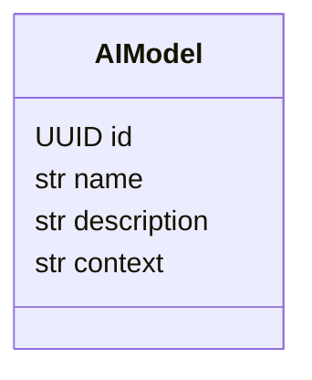

# Модуль `llm_router`

## 1. Название и краткое описание

`llm_router` управляет списком AI-моделей и маршрутизирует запросы к LLM text/image провайдерам. Он предоставляет REST API для CRUD/list моделей и proxy endpoints `/responses/text`, `/responses/image`.

## 2. Границы ответственности

**Делает:** хранит `AIModel`, выбирает/вызывает text/image clients, предоставляет LLM responses. **Не делает:** не реализует клиентскую orchestration tools — это в `llm_service`; не хранит course-specific knowledge.

## 3. Глоссарий

| Термин | Значение |
|---|---|
| `AIModel` | Запись модели с `name`, `description`, `context`. |
| `LLMTextRouter` | Сервис маршрутизации text requests к OpenAI-compatible API. |
| `LLMImageRouter` | Сервис маршрутизации image requests. |

## 4. Структура папок

```text
backend/src/llm_router/
├── api/v1/              # ai_models.py, llm.py
├── domain/              # AIModel dataclass, permissions
├── infra/               # SQLAlchemy model/repository
├── dependencies.py      # OpenAI clients, repo/service deps
├── schemas.py           # AIModelSchema, cache protocol
├── services.py          # LLMRouter services
├── prompts.py           # system prompts
└── utils.py             # parsing/retry helpers
```

## 5. Доменная модель

`AIModel` в `domain/dataclass.py` наследует shared entity и содержит `name`, `description`, `context`.



## 6. Ключевые сценарии (use cases)

| Сценарий | Входные данные | Шаги | Результат | Ошибки |
|---|---|---|---|---|
| Добавить модель | `AIModelSchema` | permission → repository.create → commit | `AIModel` | 401/403/422/500 |
| Получить модели | `Pagination` | identity → repository.find | `Page[AIModel]` | 401/422/500 |
| Удалить модель | `uid` | permission → repository.delete → commit | 204 | 401/403/404/500 |
| Text response | `LLMTextRequest` | identity → router → OpenAI client → parse | `LLMTextResponse` | 400 parse/structured, 401, 500 |
| Image response | `LLMImageRequest` | identity → image router/client | `LLMImageResponse` | 401/422/500 |

## 7. Публичный API модуля

| Метод | Путь | Назначение | Авторизация | Файл |
|---|---|---|---|---|
| POST | `/api/v1/ai-models/` | Добавить AI-модель | `ai_model:create` | `api/v1/ai_models.py` |
| POST | `/api/v1/ai-models/get` | Получить модели | `CurrentIdentity` | `api/v1/ai_models.py` |
| DELETE | `/api/v1/ai-models/{uid}` | Удалить модель | `ai_model:delete` | `api/v1/ai_models.py` |
| POST | `/api/v1/responses/text` | Text LLM response | `CurrentIdentity` | `api/v1/llm.py` |
| POST | `/api/v1/responses/image` | Image LLM response | `CurrentIdentity` | `api/v1/llm.py` |

### POST `/api/v1/ai-models/`

Body `AIModelSchema`: `name`, `description`, `context`. Успешный ответ `201 Created`, `AIModel`. Ошибки: 401/403/422/500. Побочный эффект: insert `ai_models`. Неидемпотентен.

### POST `/api/v1/ai-models/get`

Body `Pagination`; успешный ответ `200 OK`, `Page[AIModel]`. Ошибки: 401/422/500. Read-only, идемпотентен.

### DELETE `/api/v1/ai-models/{uid}`

Route `uid: UUID`; успешный ответ `204 No Content`. Ошибки: 401/403/404/422/500. Побочный эффект: удаление модели.

### POST `/api/v1/responses/text`

Query `model: str | None`. Body `LLMTextRequest` из `llm_service.schemas`: `input/messages`, `tools`, `instructions`, `reasoning`, `temperature`, `text`. Успешный ответ `LLMTextResponse`: `output`, `raw_text`, `tool_calls`, `messages`, `total_tokens`. Ошибки: 401, 400 `ValueError` from parse/structured output, 422, 500. Побочный эффект: внешний LLM вызов; может иметь стоимость/лимиты. Неидемпотентен с точки зрения внешнего провайдера.

### POST `/api/v1/responses/image`

Query `model: str | None`. Body `LLMImageRequest`: `image`, `prompt/messages`, `quality`, `size`, `output_format`. Ответ `LLMImageResponse`: `size`, `image`, `total_tokens`, `output_format`. Ошибки: 401/422/500. Побочный эффект: внешний image LLM вызов.

**Внутренние контракты:** endpoints `/responses/*` вызываются `llm_service.services.LLMTextService`/`LLMImageService`.

## 8. События

Не применимо: domain/integration events не найдены.

## 9. Хранение данных

| Таблица | Назначение | Ключевые поля |
|---|---|---|
| `ai_models` | AI model registry | `name` unique, `description`, `context` |

## 10. Зависимости

IAM (`CurrentIdentity`, permissions), `llm_service` schemas, `AsyncOpenAI`, text/image provider configs, PostgreSQL, `tenacity`, `langsmith`.

## 11. Конфигурация

| Параметр | Назначение | Значение по умолчанию | Обязательность |
|---|---|---|---|
| `aitunnel_config` | Text OpenAI-compatible client | В config | Для text responses |
| `proxy_api_config` | Image provider client | В config | Для image responses |
| `settings.text_ai_model` | Модель по умолчанию | В settings | Для выбора model |

## 12. Фоновые процессы

Не применимо.

## 13. Безопасность и права доступа

Create/delete AI models требуют permissions. Read list требует identity. LLM response endpoints требуют identity, но без отдельного permission.

## 14. Каталог ошибок модуля и их HTTP-статусов

### a) Единый формат ошибки

`DomainError`/`ValueError` обрабатываются `shared/api/exception_handler.py`.

### b) Таблица ошибок

| Ошибка | HTTP | Когда | Где | Endpoints |
|---|---:|---|---|---|
| `PermissionDeniedError` | 403 | Нет `ai_model:create/delete` | IAM dependency | ai-models create/delete |
| `UnauthorizedError` | 401 | Нет/плохой Bearer | IAM identity | all |
| `ValueError` | 400 | `parse_llm_response`, empty model selection | `utils.py`/`services.py` | responses/text |
| `StructuredOutputError` | 400 | Ошибка structured output | `utils.py` | responses/text |
| `NotFoundError` | 404 | Удаление/чтение отсутствующей модели, если repo так маппит | repository | delete |
| FastAPI validation | 422 | Невалидный request | FastAPI | all |
| Unhandled/provider error | 500 | OpenAI/provider/DB без маппинга | services/repo | all |

### c) Правила маппинга

Shared handlers + FastAPI default. Provider exceptions явно не нормализованы в прочитанной сводке.

### d) Формат ошибок валидации

Стандартный FastAPI 422; `ValueError` — 400 с `error.grant`.

## 15. Тестирование

В `backend/tests/unit/ai_models` есть тесты, но они выглядят устаревшими: импортируют `domain.dataclasses` и сущности `UserModelPreference`, которых в текущем коде не видно.

## 16. Как с этим работать разработчику

При добавлении провайдера обновляйте dependencies/config/services и явно маппьте provider errors. Для новых model endpoints добавляйте permissions в `domain/permissions/ai_models.py`.

## 17. Наблюдения и технический долг

- Tests рассинхронизированы с текущими файлами.
- `POST /ai-models/get` использует POST для read/list.
- `_select_model_by_length()` может упасть на пустом `filtered_models`.
- `/responses/*` не имеют отдельного permission, только identity.
- `AIModel` возвращается напрямую как entity.

## 18. Открытые вопросы

- Нужно ли permission для вызова `/responses/*`?
- Какие provider errors должны возвращаться как 4xx/5xx?
