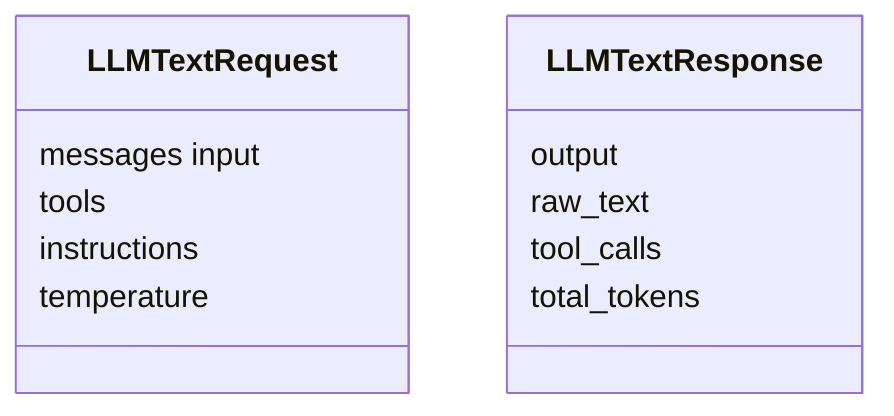

# Модуль `llm_service`

## 1. Название и краткое описание

`llm_service` — клиентская библиотека для вызова `llm_router` из других модулей. Она описывает DTO LLM-запросов/ответов, tool schema, middleware hooks и сервисы `LLMTextService`/`LLMImageService`.

## 2. Границы ответственности

**Делает:** формирует requests к `/api/v1/responses/text|image`, исполняет tool calls, предоставляет strict schemas. **Не делает:** не предоставляет HTTP endpoints и не выбирает provider напрямую — это делает `llm_router`.

## 3. Глоссарий

| Термин | Значение |
|---|---|
| `LLMTextRequest` | DTO запроса к text LLM. |
| `LLMTextResponse` | DTO ответа text LLM. |
| `StructuredTool` | Описание callable tool для LLM. |
| `Runtime` | Контекст исполнения service/tool. |

## 4. Структура папок

```text
backend/src/llm_service/
├── schemas.py        # DTO/protocols/runtime
├── services.py       # LLMTextService, LLMImageService
├── dataclasses.py    # ParamGroup, StructuredTool
├── tools.py          # decorator tool/schema generation
├── middleware.py     # agent middleware hooks
├── strict_schema.py  # strict JSON schema helpers
└── __init__.py       # public exports
```

## 5. Доменная модель

Собственных persistent entities нет. Основные модели — Pydantic DTO.



## 6. Ключевые сценарии (use cases)

| Сценарий | Входные данные | Шаги | Результат | Ошибки |
|---|---|---|---|---|
| Invoke text | messages/tools/schema | middleware → POST `/responses/text` → process tool calls | `LLMTextResponse` | HTTP/validation/tool errors |
| Invoke image | image/prompt | POST `/responses/image` | `LLMImageResponse` | HTTP/validation |
| Tool execution | `tool_call` | find tool → execute → append tool output | response messages | tool exception logged as tool output error |

## 7. Публичный API модуля

HTTP endpoints не предоставляет.

**Внутренние контракты:**

| Класс/функция | Файл | Назначение |
|---|---|---|
| `LLMTextService.invoke()` | `services.py` | Вызов text LLM через service client. |
| `LLMImageService.invoke()` | `services.py` | Вызов image LLM. |
| `tool` | `tools.py` | Декоратор для tool schema. |
| `BaseAgentMiddleware` | `middleware.py` | Hooks вокруг invoke/tool execution. |

## 8. События

Не применимо: events не найдены.

## 9. Хранение данных

Не применимо: ORM tables нет.

## 10. Зависимости

`SrvBaseClient`, `aiohttp.ClientSession`, Pydantic, OpenAI tool types, `llm_router` HTTP endpoints.

## 11. Конфигурация

| Параметр | Назначение | Значение по умолчанию | Обязательность |
|---|---|---|---|
| Base URL/token session в `SrvBaseClient` | Авторизованные HTTP вызовы router | В shared service client | Обязателен |
| `model` query | Явный выбор LLM model | Не задан | Опционален |

## 12. Фоновые процессы

Не применимо.

## 13. Безопасность и права доступа

Модуль сам не проверяет права. Авторизация зависит от `_get_token_session()` в `SrvBaseClient` и прав endpoint `llm_router`.

## 14. Каталог ошибок модуля и их HTTP-статусов

### a) Единый формат ошибки

Не применимо напрямую: это client library. При вызове через API ошибки могут маппиться вызывающим endpoint или shared handlers.

### b) Таблица ошибок

| Ошибка | HTTP | Когда | Где |
|---|---:|---|---|
| `ValueError` | 400 при выходе в FastAPI | Некорректные tool param groups, duplicates | `tools.py`, `dataclasses.py` |
| Tool exception | не HTTP | Ошибка внутри tool | `services.py`, ловится и возвращается как tool output `error` |
| HTTP provider error | зависит от caller | `_send_request()` не вызывает `raise_for_status()` | `services.py` |
| Pydantic validation | зависит | Ответ router не соответствует DTO | `services.py` |

### c) Правила маппинга

Собственного HTTP маппинга нет.

### d) Формат ошибок валидации

Pydantic validation локально; если исключение выйдет в FastAPI, будет 500 или обработка caller.

## 15. Тестирование

Актуальные тесты для `llm_service` не найдены.

## 16. Как с этим работать разработчику

Определяйте tools через `tool`, следите за уникальностью имён и strict schema. Для production-вызовов учитывайте, что tool exceptions скрываются в tool output, а не пробрасываются.

## 17. Наблюдения и технический долг

- `LLMTextService.invoke()` содержит `await asyncio.sleep(15)` перед запуском.
- `_send_request()` не вызывает `raise_for_status()`.
- Tool exceptions логируются и возвращаются модели как `error`, что может скрывать failures.
- В коде есть комментарии с альтернативными hardcoded model query.

## 18. Открытые вопросы

- Зачем нужен фиксированный sleep 15 секунд?
- Нужно ли пробрасывать tool exceptions вызывающему коду?
- Должен ли client нормализовать HTTP errors router/provider?
