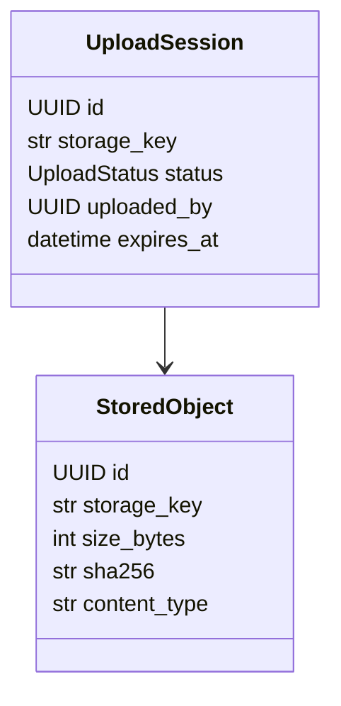

# Модуль `media`

## 1. Название и краткое описание

`media` управляет загрузкой и скачиванием файлов через S3-compatible storage. Модуль создаёт presigned upload/download URLs, хранит upload sessions и metadata `StoredObject`.

## 2. Границы ответственности

**Делает:** presigned URL, подтверждение upload, проверка metadata, хранение объектов. **Не делает:** не хранит binary content в БД и не определяет бизнес-связи файлов с курсами.

## 3. Глоссарий

| Термин | Значение |
|---|---|
| `UploadSession` | Временная запись процесса загрузки. |
| `StoredObject` | Метаданные загруженного объекта. |
| `storage_key` | Ключ объекта в S3. |
| `UploadStatus` | `pending`, `validating`, `completed`, `failed`, `expired`. |

## 4. Структура папок

```text
backend/src/media/
├── api/v1/attachments.py
├── application/          # DTO, protocols, AttachmentService
├── dependencies/         # repo/service dependencies
├── domain/               # entities, vo, exceptions, constants
└── infra/database/       # ORM, mappers, repos including S3 client
```

## 5. Доменная модель



## 6. Ключевые сценарии (use cases)

| Сценарий | Входные данные | Шаги | Результат | Ошибки |
|---|---|---|---|---|
| Presigned upload | `CreateUploadDTO` | identity → service → S3 URL → upload session | `UploadResponse` | validation/S3/internal |
| Confirm upload | `upload_id` | read session → validate object → create `StoredObject` | `StoredObject` | 400/403/404 |
| Presigned download | `stored_object_id` | read object → S3 URL | `PresignedDownloadResponse` | 404/S3 |
| Get attachment | `stored_object_id` | repository read | `StoredObject` | 404 |

## 7. Публичный API модуля

| Метод | Путь | Назначение | Авторизация | Файл |
|---|---|---|---|---|
| POST | `/api/v1/attachments/presigned-upload` | Получить URL загрузки | `CurrentIdentity` | `api/v1/attachments.py` |
| POST | `/api/v1/attachments/confirm-upload/{upload_id}` | Подтвердить upload | `CurrentIdentity` | `api/v1/attachments.py` |
| GET | `/api/v1/attachments/{stored_object_id}/presigned-download` | URL скачивания | `CurrentIdentity` | `api/v1/attachments.py` |
| GET | `/api/v1/attachments/{stored_object_id}` | Метаданные файла | `CurrentIdentity` | `api/v1/attachments.py` |

### POST `/api/v1/attachments/presigned-upload`

Body `CreateUploadDTO` с camelCase aliases: `filename`, `contentType`, `folder`, `sizeBytes`, `sha256`. Ответ `200 OK`, `UploadResponse` (`id`, `upload.url/method/headers/expiresIn`). Ошибки: 401, 422, 500/S3. Побочный эффект: запись `upload_sessions`. Неидемпотентен.

### POST `/api/v1/attachments/confirm-upload/{upload_id}`

Route `upload_id: UUID`. Body не используется по сигнатуре; `ConfirmUploadRequest` определён, но endpoint его не принимает. Ответ `201 Created`, `StoredObject`. Ошибки: 400 size/hash/status mismatch, 403 owner mismatch, 404 upload/S3 object, 401, 422, 500. Побочные эффекты: create/update `stored_objects`, mark upload completed.

### GET `/api/v1/attachments/{stored_object_id}/presigned-download`

Ответ `200 OK`, `PresignedDownloadResponse`: `download_url`, `storage_key`, `expires_in`. Ошибки: 401, 404, 422, 500/S3. Read-only для БД; создаёт временный URL.

### GET `/api/v1/attachments/{stored_object_id}`

Ответ `200 OK`, `StoredObject`. Если repository вернул `None`, endpoint выбрасывает `NotFoundError`. Идемпотентен.

**Внутренние контракты:** `AttachmentService` используется `courses/infra/media_client.py` через HTTP endpoints.

## 8. События

Не применимо: events не найдены.

## 9. Хранение данных

| Таблица | Назначение | Ключевые поля |
|---|---|---|
| `upload_sessions` | Upload process | `storage_key` unique, `status`, `uploaded_by`, `expires_at`, FK `object_id` |
| `stored_objects` | Object metadata | `storage_key` unique, unique `(sha256,size_bytes)`, `content_type` |

## 10. Зависимости

IAM identity, S3-compatible storage via `aiobotocore`, SQLAlchemy/PostgreSQL, shared domain errors.

## 11. Конфигурация

| Параметр | Назначение | Значение по умолчанию | Обязательность |
|---|---|---|---|
| S3 endpoint/bucket/credentials | Object storage | `core/s3/config.py` | Обязательно |
| Presigned URL TTL | Время жизни URL | В S3 service/config | Нужно для upload/download |

## 12. Фоновые процессы

Не применимо. Очистка expired upload sessions в коде не найдена.

## 13. Безопасность и права доступа

Все endpoints требуют `CurrentIdentity`. Confirm upload проверяет владельца upload (`ForbiddenError`). Отдельных permissions нет.

## 14. Каталог ошибок модуля и их HTTP-статусов

### a) Единый формат ошибки

`DomainError`/`ValueError` обрабатываются shared handler.

### b) Таблица ошибок

| Ошибка | HTTP | Когда | Где | Endpoints |
|---|---:|---|---|---|
| `NotFoundError` | 404 | Upload/object не найден | service/API | confirm/get/download |
| `ForbiddenError` | 403 | Upload принадлежит другому user | service | confirm |
| `BadRequestError` | 400 | Hash/size/status mismatch | service | confirm |
| `S3NotFoundError` | 404 | Объект отсутствует в S3 | `domain/exceptions.py`/S3 repo | confirm/download |
| `ValueError` | 400 | multipart chunk size < 5 MiB | S3 repo | upload stream internal |
| Validation | 422 | Невалидный DTO/path | FastAPI | all |
| Unhandled/S3 | 500 | S3/DB без маппинга | infra | all |

### c) Правила маппинга

Shared `DomainError` handler; S3-specific `S3NotFoundError` наследует `DomainError`.

### d) Формат ошибок валидации

FastAPI `422`; `ValueError` → 400 shared format.

## 15. Тестирование

Тесты для `media` не найдены.

## 16. Как с этим работать разработчику

Для новых операций с файлами держите binary в S3, а в БД только metadata. Проверяйте owner и status upload session перед созданием `StoredObject`.

## 17. Наблюдения и технический долг

- `ConfirmUploadRequest` определён, но endpoint не использует body.
- `S3Client.create_upload_url()` принимает checksum, но по анализу может игнорировать его.
- `S3Client.upload_stream()` использует `async with self.get_client as client`, что выглядит как пропущенный вызов `get_client()`.
- Нет явной проверки `expires_at` при confirm upload.
- Нет отдельного permission layer кроме identity.

## 18. Открытые вопросы

- Нужно ли body подтверждения upload с checksum/storage_key?
- Должен ли confirm проверять expiry upload session?
- Как очищаются expired/failed upload sessions?
