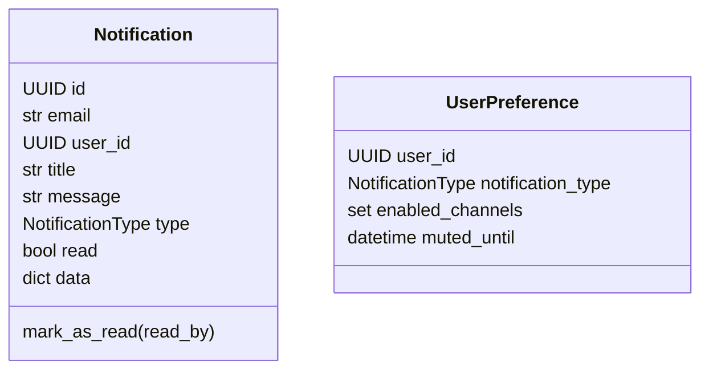

# Модуль `notifications`

## 1. Название и краткое описание

`notifications` отвечает за in-app/email уведомления и SSE-stream для текущего пользователя. Модуль потребляет интеграционные события приглашений из курсов, организаций и IAM и превращает их в `Notification`.

## 2. Границы ответственности

**Делает:** хранит уведомления и preferences, отправляет через email/in-app channels, отдаёт список/счётчик/SSE. **Не делает:** не создаёт бизнес-события приглашений и не управляет пользователями.

## 3. Глоссарий

| Термин | Значение |
|---|---|
| `Notification` | Уведомление с email/user_id/title/message/type/read/data. |
| `UserPreference` | Настройки каналов уведомлений пользователя. |
| `ChannelType` | `email` или `in_app`. |
| SSE | Server-Sent Events stream `/notifications/stream`. |

## 4. Структура папок

```text
backend/src/notifications/
├── api/v1/notifications.py  # HTTP/SSE API
├── api/v1/handlers.py       # Rabbit/FastStream subscribers
├── application/             # channels, factories, repos, resolvers, services, DTO
├── dependencies/            # repo/service deps
├── domain/                  # entities, VO, exceptions
└── infra/database/          # ORM, mappers, repositories
```

## 5. Доменная модель



## 6. Ключевые сценарии (use cases)

| Сценарий | Входные данные | Шаги | Результат | Ошибки |
|---|---|---|---|---|
| Получение уведомлений | identity + pagination + `unread_only` | repository.get_by_user | `Page[Notification]` | 401/422/500 |
| Mark as read | notification_id + identity | service.read → domain permission → save | `Notification` | 401/403/404 |
| SSE stream | identity | connect queue → send unread → wait queue | `EventSourceResponse` | 401/500 |
| Event handling | `CourseInvited`/`OrganizationInvited`/`UserInvited` | factory → service.notify → channels | saved/sent notification | `NotificationSendingFailedError` |

## 7. Публичный API модуля

| Метод | Путь | Назначение | Авторизация | Файл |
|---|---|---|---|---|
| GET | `/api/v1/notifications` | Мои уведомления | `CurrentIdentity` | `api/v1/notifications.py` |
| GET | `/api/v1/notifications/unread-count` | Количество непрочитанных | `CurrentIdentity` | `api/v1/notifications.py` |
| PATCH | `/api/v1/notifications/{notification_id}/read` | Пометить прочитанным | `CurrentIdentity` | `api/v1/notifications.py` |
| GET | `/api/v1/notifications/stream` | SSE stream | `CurrentIdentity` | `api/v1/notifications.py` |

### GET `/api/v1/notifications`

Query: pagination (`page`, `size`) и `unread_only: bool` (`Query(..., description=...) = False`). Ответ `200 OK`, `Page[Notification]`. Ошибки: 401, 422, 500. Идемпотентен.

### GET `/api/v1/notifications/unread-count`

Ответ `200 OK`, `UnreadCountOut` (`unread_count: int | None`). Ошибки: 401, 500. Идемпотентен.

### PATCH `/api/v1/notifications/{notification_id}/read`

Route `notification_id: UUID`. Ответ `200 OK`, `Notification`. Ошибки: 401, 403 если пользователь пытается читать чужое уведомление, 404 если notification не найдено, 422, 500. Побочный эффект: `read=true`.

### GET `/api/v1/notifications/stream`

Ответ `EventSourceResponse`. При подключении отправляет до 50 непрочитанных уведомлений, затем слушает queue; heartbeat comment `ping`. Ошибки: 401, 500. Побочный эффект: in-memory SSE connection registration.

**Внутренние контракты:** subscribers в `api/v1/handlers.py` потребляют `courses.invited`, `organizations.invited`, `users.invited`, а также очередь `notifications.sse`.

## 8. События

| Название | Публикуется/потребляется | Когда | Структура | Кто подписан |
|---|---|---|---|---|
| `courses.invited` | Потребляется | Приглашение в курс | `CourseInvited` | `on_course_invited` |
| `organizations.invited` | Потребляется | Приглашение в организацию | `OrganizationInvited` | `on_organization_invited` |
| `users.invited` | Потребляется | Системное приглашение | `UserInvited` | `on_user_invited` |
| `notifications.sse` | Потребляется | Готовое notification для SSE | `Notification` | `handle_notification` |

## 9. Хранение данных

| Таблица | Назначение | Ключевые поля |
|---|---|---|
| `notifications` | Уведомления | `email`, `user_id`, `title`, `message`, `notification_type`, `read`, `data JSONB` |
| `user_preferences` | Настройки | `user_id`, `notification_type`, `enabled_channels JSONB`, `muted_until`, unique `(user_id, notification_type)` |

## 10. Зависимости

IAM identity, Rabbit/FastStream, SMTP mail client, shared SSE manager, SQLAlchemy/PostgreSQL, events из `courses`, `organization`, `iam`.

## 11. Конфигурация

| Параметр | Назначение | Значение по умолчанию | Обязательность |
|---|---|---|---|
| Rabbit config | Event subscribers | `core/rabbit/config.py` | Для event handling |
| Mail config | Email channel | `core/mail/config.py` | Для email notifications |
| SSE queue size | In-memory queue | `maxsize=10` в endpoint | Локальная настройка |

## 12. Фоновые процессы

Rabbit subscribers в `api/v1/handlers.py` работают как event handlers. Отдельных scheduled jobs нет.

## 13. Безопасность и права доступа

HTTP endpoints требуют `CurrentIdentity`. `Notification.mark_as_read()` проверяет, что `read_by` совпадает с владельцем notification.

## 14. Каталог ошибок модуля и их HTTP-статусов

### a) Единый формат ошибки

Shared `DomainError`/`ValueError` handler.

### b) Таблица ошибок

| Ошибка | HTTP | Когда | Где | Endpoints |
|---|---:|---|---|---|
| `NotFoundError` | 404 | Notification не найдено | service | mark read |
| `PermissionDeniedError` | 403 | Чужое notification | domain entity | mark read |
| `NotificationSendingFailedError` | 502 | Ошибка email channel | domain/application | event handlers |
| `ValueError` | 400 | invalid mute duration | `UserPreference.mute()` | preferences API отсутствует |
| Validation | 422 | query/path invalid | FastAPI | HTTP endpoints |
| Unhandled | 500 | DB/Rabbit/SSE runtime | app | all |

### c) Правила маппинга

HTTP через shared/FastAPI handlers. Ошибки в subscribers не описаны HTTP-статусами, так как это event consumers.

### d) Формат ошибок валидации

FastAPI 422; `ValueError` → shared 400.

## 15. Тестирование

Тесты для `notifications` не найдены.

## 16. Как с этим работать разработчику

Для нового события добавьте factory в `application/factories.py`, subscriber в `api/v1/handlers.py` и настройте каналы через resolver. Для нового канала реализуйте channel interface.

## 17. Наблюдения и технический долг

- `unread_only` объявлен как `Query(...) = False`, что смешивает required marker и default.
- SSE отдаёт `ServerSentEvent(data=payload)` с dict; нужно проверить фактическую сериализацию.
- `notify()` сохраняет notification до отправки каналов; outbox/retry не видно.
- Preferences API отсутствует.
- `EmailChannel` при отсутствии template логирует warning, но может продолжить отправку с `template_name=None`.

## 18. Открытые вопросы

- Нужны ли API для preferences?
- Как должны retry-иться failed notifications?
- Должен ли SSE payload сериализоваться явно в JSON string?
