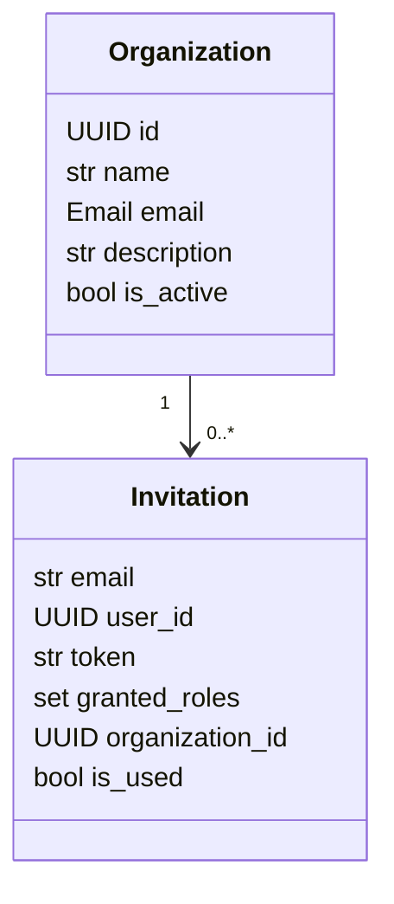

# Модуль `organization`

## 1. Название и краткое описание

`organization` управляет организациями и приглашениями пользователей в организации. Модуль предоставляет CRUD/list API организаций, invitation flow и событие `OrganizationInvited` для уведомлений.

## 2. Границы ответственности

**Делает:** создаёт/читает/редактирует/soft-delete организации, создаёт/принимает/отзывает invitations. **Не делает:** не хранит пользователей и роли IAM, а использует `iam` memberships/permissions.

## 3. Глоссарий

| Термин | Значение |
|---|---|
| `Organization` | Организация с name/email/description/is_active. |
| `Invitation` | Приглашение пользователя в организацию. |
| `OrganizationInvited` | Событие для уведомлений о приглашении. |

## 4. Структура папок

```text
backend/src/organization/
├── api/v1/organization.py   # Organization CRUD/list
├── api/v1/invitations.py    # Invitations API
├── application/             # DTO, repos, services
├── dependencies/            # DI repos/services/pagination
├── domain/                  # entities, events, permissions
└── infra/                   # DB models/repos, external APIs/client
```

## 5. Доменная модель



## 6. Ключевые сценарии (use cases)

| Сценарий | Входные данные | Шаги | Результат | Ошибки |
|---|---|---|---|---|
| Create organization | `OrganizationCreate` | permission/authorize → service.create | `Organization` | 401/403/409 |
| Edit organization | `organization_id`, DTO | permission → service.edit | `Organization` | 404/403 |
| Delete organization | `organization_id` | permission → repository.update(is_active=False) | 204 | 404/403 |
| Create invitation | `InvitationCreate` | permission → check user/membership → create event | `Invitation` | 404/409 |
| Accept invitation | token + identity | validate token → create membership | membership/result | 404/409 |

## 7. Публичный API модуля

| Метод | Путь | Назначение | Авторизация | Файл |
|---|---|---|---|---|
| POST | `/api/v1/organizations` | Создать организацию | `organization:create` + `authorize` | `api/v1/organization.py` |
| GET | `/api/v1/organizations/{organization_id}` | Получить организацию | `organization:organization_read` | `api/v1/organization.py` |
| PATCH | `/api/v1/organizations/{organization_id}` | Редактировать | `organization:update` | `api/v1/organization.py` |
| GET | `/api/v1/organizations` | Список организаций | `organization:read` + `authorize` | `api/v1/organization.py` |
| DELETE | `/api/v1/organizations/{organization_id}` | Soft delete | `organization:delete` | `api/v1/organization.py` |
| POST | `/api/v1/organizations/invitations` | Создать invitation | `organization-invitations:invite` | `api/v1/invitations.py` |
| POST | `/api/v1/organizations/invitations/accept/{token}` | Принять invitation | `CurrentIdentity` | `api/v1/invitations.py` |
| DELETE | `/api/v1/organizations/invitations/revoke/{invitation_id}` | Отозвать invitation | `organization-invitations:delete` | `api/v1/invitations.py` |

### POST `/api/v1/organizations`

Body `OrganizationCreate`: `name`, `email`, `description`. Ответ `201 Created`, `Organization`. Ошибки: 401/403/409 duplicate email, 422, 500. Побочный эффект: insert `organizations`. Неидемпотентен.

### GET `/api/v1/organizations/{organization_id}`

Route UUID. Ответ `200 OK`, `Organization`. Ошибки: 401/403/404/422/500. Идемпотентен.

### PATCH `/api/v1/organizations/{organization_id}`

Body `OrganizationEdit`: nullable `name`, `email`, `description`. Ответ `200 OK`, `Organization`. Ошибки: 401/403/404/409/422/500. Побочный эффект: update.

### GET `/api/v1/organizations`

Query pagination via `paginate_organizations`. Ответ `200 OK`, `Page[Organization]`. Ошибки: 401/403/422/500.

### DELETE `/api/v1/organizations/{organization_id}`

Ответ `204 No Content`. Побочный эффект: `is_active=False`, не физическое удаление. Ошибки: 401/403/404/422/500.

### POST `/api/v1/organizations/invitations`

Body `InvitationCreate` с camelCase aliases: `email`, `grantedRoles`, `organizationId`. Ответ `201 Created`, `Invitation`. Ошибки: 401/403/404/409/422/500. Побочный эффект: insert invitation, event `OrganizationInvited`.

### POST `/api/v1/organizations/invitations/accept/{token}`

Route `token`. Авторизация `CurrentIdentity`. Ответ `201 Created` по decorator; фактический тип зависит от service. Ошибки: 401/404 invalid token, 409 already member, 422, 500. Побочный эффект: membership через IAM/external client, invitation used.

### DELETE `/api/v1/organizations/invitations/revoke/{invitation_id}`

Route UUID. Ответ `204 No Content`. Ошибки: 401/403/404/422/500. Побочный эффект: revoke/delete invitation.

**Внутренние контракты:** `SrvOrganizationClient`, `MembershipClient`, external helpers `get_user_by_email`, `invite_user_in_system` в `infra/external_apis.py`.

## 8. События

| Название | Публикуется/потребляется | Когда | Структура | Кто подписан |
|---|---|---|---|---|
| `OrganizationInvited` / `organizations.invited` | Публикуется | Создание invitation | invitation id/email/roles/org/invited_by/url | `notifications/api/v1/handlers.py` |

## 9. Хранение данных

| Таблица | Назначение | Ключевые поля |
|---|---|---|
| `organizations` | Организации | `name`, unique `email`, `description`, `is_active` |
| `organization_invitations` | Приглашения | `email`, `user_id`, unique `token`, `granted_roles JSONB`, `organization_id`, `expires_at`, `is_used` |

## 10. Зависимости

IAM (`CurrentIdentity`, `require_permissions`, `authorize`, memberships), notifications through event, shared transaction/page/errors, PostgreSQL, external service clients.

## 11. Конфигурация

| Параметр | Назначение | Значение по умолчанию | Обязательность |
|---|---|---|---|
| `settings.frontend_url` | URL invitation accept | Не задано в модуле | Нужен для event URL |
| Service client config | Вызовы IAM/user/membership | `infra/services/config` | Нужен invitation flow |

## 12. Фоновые процессы

Не применимо: jobs/schedulers нет.

## 13. Безопасность и права доступа

Permissions объявлены в `domain/permissions/organizations.py` и `domain/permissions/invitations.py`. Create/list дополнительно вызывают `authorize(identity, permission)`. Accept invitation требует `CurrentIdentity`.

## 14. Каталог ошибок модуля и их HTTP-статусов

### a) Единый формат ошибки

Shared handler `DomainError`/`ValueError`.

### b) Таблица ошибок

| Ошибка | HTTP | Когда | Где | Endpoints |
|---|---:|---|---|---|
| `AlreadyExistsError` | 409 | Duplicate org email/existing membership | services | create/accept |
| `NotFoundError` | 404 | Organization/invitation/user missing | services/repos | many |
| `PermissionDeniedError` | 403 | Нет permission/scope | IAM policies | protected |
| `ValueError` | 400 | Email VO/validation | VO/shared | create/edit |
| Validation | 422 | DTO/path invalid | FastAPI | all |
| Unhandled integration | 500 | External client/DB without mapping | infra/services | invitations |

### c) Правила маппинга

Shared handler for `DomainError`/`ValueError`, FastAPI default for validation/unhandled.

### d) Формат ошибок валидации

FastAPI 422; `ValueError` → 400.

## 15. Тестирование

Тесты для `organization` не найдены.

## 16. Как с этим работать разработчику

Новые organization operations должны использовать services/repositories и permissions. Для invitation side effects добавляйте/обновляйте event factories/subscribers в notifications.

## 17. Наблюдения и технический долг

- `OrganizationService.read()` по анализу вызывает repository read дважды.
- В `InvitationService.create()` возможно перепутан порядок аргументов `get_user_membership(user.id, dto.organization_id)` vs `(organization_id, user_id)`.
- Сообщение accept содержит copy-paste: `User is already a member of the course.`
- `external_apis.py` использует bare `except` и возвращает `None`.
- `OrganizationInvited` docstring говорит «Приглашение в курс».
- `InvitationCreate` имеет alias_generator, но `populate_by_name=True` не указан.

## 18. Открытые вопросы

- Какой точный response body у accept organization invitation?
- Нужно ли soft delete реализовать через domain method?
- Должны ли external API errors возвращаться как 502 вместо `None`/404?
