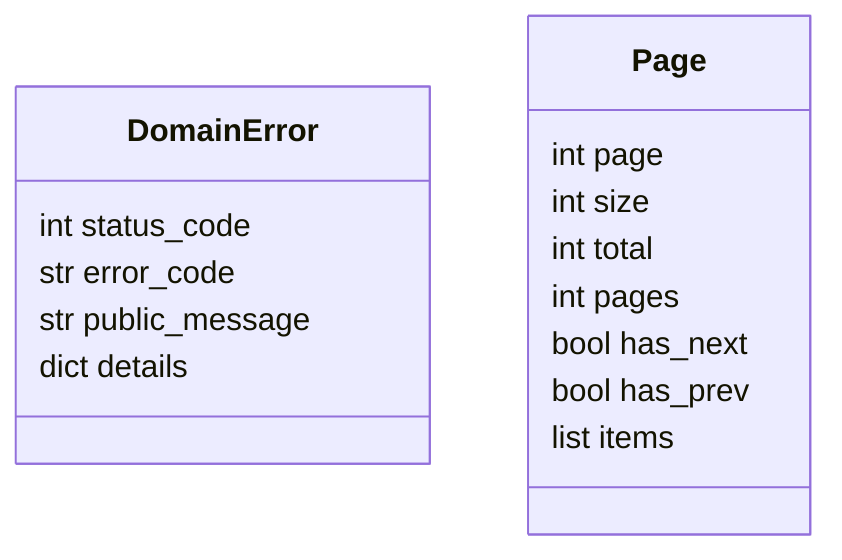

# Модуль `shared`

## 1. Название и краткое описание

`shared` — общий слой/Shared Kernel: DTO пагинации, базовые domain entities/errors/events, зависимости FastAPI, transaction/event publisher, middleware и service clients. Модуль используется почти всеми бизнес-модулями.

## 2. Границы ответственности

**Делает:** предоставляет общие abstractions и инфраструктурные helpers. **Не делает:** не содержит бизнес-правил конкретного домена.

## 3. Глоссарий

| Термин | Значение |
|---|---|
| `DomainError` | Базовый тип доменной ошибки с HTTP status/error_code. |
| `Page`/`Pagination` | Общие DTO пагинации. |
| `Event` | Базовое доменное событие. |
| `Transaction` | Unit of Work + activity + event publishing flow. |

## 4. Структура папок

```text
backend/src/shared/
├── api/              # exception_handler, include_routers
├── application/      # DTO, transaction/event publisher abstractions
├── dependencies/     # session, pagination, events, mail, rate limiter
├── domain/           # base entities/events/exceptions/value objects
├── infra/            # middlewares/services
├── schemas.py        # shared API schemas/reexports
└── utils/            # helpers
```

## 5. Доменная модель



## 6. Ключевые сценарии (use cases)

| Сценарий | Входные данные | Шаги | Результат | Ошибки |
|---|---|---|---|---|
| Exception handling | exception | handler maps to JSON | HTTP error response | unhandled → 500 |
| Pagination | page/size | repository returns page | `Page[T]` | validation |
| Transaction | entities/events | recorder → commit → publish | persisted + events | DB/event errors |

## 7. Публичный API модуля

HTTP endpoints нет.

**Внутренние контракты:** `setup_exception_handlers`, `Page`, `Pagination`, `BaseQueryParamFilters`, `DomainError` subclasses, `SessionDep`, `PaginationDep`, `EventPublisher`, `SrvBaseClient`.

## 8. События

Shared определяет базовые contracts для событий и event publisher. Конкретные event types находятся в бизнес-модулях.

## 9. Хранение данных

Собственных таблиц нет.

## 10. Зависимости

FastAPI, SQLAlchemy session dependencies, mail dependencies, shared service clients, middleware.

## 11. Конфигурация

Не имеет собственных явных env параметров в README scope; использует configs из `core` и вызывающих модулей.

## 12. Фоновые процессы

Не применимо.

## 13. Безопасность и права доступа

Shared не проверяет права, но предоставляет middleware/dependencies, используемые модулями. Rate limiter dependency присутствует в `dependencies/rate_limiter.py`.

## 14. Каталог ошибок модуля и их HTTP-статусов

### a) Единый формат ошибки

`api/exception_handler.py`:

- `DomainError` → status `exc.status_code`, body `{"error":{"code", "message", "details"}}`;
- `ValueError` → 400, body `{"error":{"grant":"VALIDATION_ERROR","message", "status":400,"details":{}}}`.

### b) Таблица ошибок

| Ошибка | HTTP | Код | Когда |
|---|---:|---|---|
| `InternalServerError` | 500 | `INTERNAL_SERVER_ERROR` | Generic server error |
| `DatabaseError` | 500 | `DATABASE_ERROR` | DB error |
| `BadRequestError` | 400 | `BAD_REQUEST` | Bad request |
| `UnauthorizedError` | 401 | `UNAUTHORIZED` | Unauthorized |
| `ForbiddenError` | 403 | `FORBIDDEN` | Forbidden |
| `NotFoundError` | 404 | `RESOURCE_NOT_FOUND` | Missing resource |
| `InvariantViolationError` | 409 | `INVARIANT_VIOLATION` | Invariant violation |
| `InvalidStateError` | 409 | `INVALID_STATE` | Invalid state |
| `AlreadyExistsError` | 409 | `ALREADY_EXISTS` | Duplicate resource |
| `EmailSendingFailedError` | 502 | `EMAIL_SENDING_FAILED` | Mail send failure |
| `RateLimitExceededError` | 429 | `RATE_LIMIT_EXCEEDED` | Rate limit |
| `UnsupportedOperationError` | 405 | `UNSUPPORTED_OPERATION` | Unsupported operation |
| `ValueError` | 400 | `VALIDATION_ERROR` | Any `ValueError` |

### c) Правила маппинга

Только `DomainError` и `ValueError` добавлены в app через `setup_exception_handlers(app)`. Остальные исключения — стандартный FastAPI/ASGI behavior.

### d) Формат ошибок валидации

FastAPI request validation не переопределён: стандартный `422`.

## 15. Тестирование

Тесты shared не найдены отдельно.

## 16. Как с этим работать разработчику

Добавляйте сюда только truly shared abstractions. Новые `DomainError` subclasses должны задавать `status_code`, `error_code`, `public_message`.

## 17. Наблюдения и технический долг

- В `ValueError` response поле называется `grant`, вероятно опечатка.
- Нет handler для FastAPI `RequestValidationError`, поэтому формат validation отличается от `ValueError`.

## 18. Открытые вопросы

- Нужно ли унифицировать формат `ValueError` и `DomainError`?
- Нужен ли единый handler для 422 validation errors?
